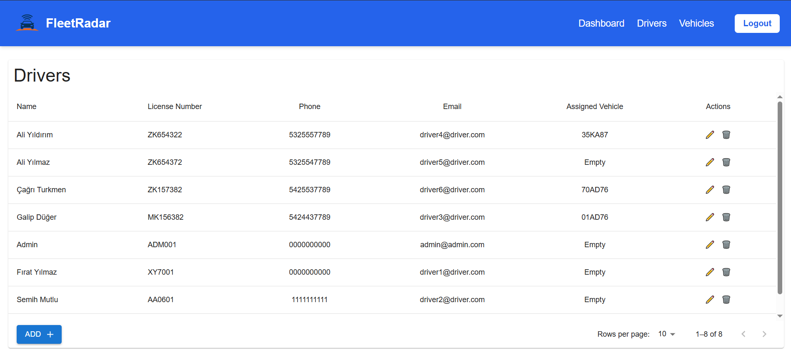

# Vehicle & Driver Tracking Panel

A full-stack web application for managing vehicle and driver assignments with role-based access, real-time location updates, and insightful dashboards.

---

## 🔧 Tech Stack

### Backend
- **Node.js** + **Express.js**
- **MongoDB** with **Mongoose**
- **JWT** Authentication
- **bcryptjs**, **dotenv**, **cors**

### Frontend
- **React.js**
- **Material UI** + **Tailwind CSS**
- **Formik** + **Yup** (form validation)
- **React Router DOM**
- **Axios** for API requests
- **Leaflet.js** for map/location features

---

## 🚀 Features

- 🔐 **Authentication**  
  Role-based login (Admin & Driver) using JWT.

- 📊 **Dashboard**  
  View statistics, charts (Pie & Line), and latest entries.

- 🧍‍♂️ **Driver Management**  
  - Add / Edit / Delete drivers  
  - View and assign vehicles  

- 🚘 **Vehicle Management**  
  - Add / Edit / Delete vehicles  
  - Assign or unassign drivers  

- 📍 **Driver Location Update**  
  Drivers can update their real-time location via browser geolocation.

- 🧠 **Reusable Components**  
  Built with modular React components like `TableComp`, `AddModal`, `EditModal`, `AssignDriverModal`, etc.

---

## 🌍 Role-Based Navigation

| Role     | Accessible Pages      |
|----------|------------------------|
| Admin    | `/dashboard`, `/drivers`, `/vehicles` |
| Driver   | `/dashboard`, `/my-vehicle` |

---

## 🔌 API Endpoints

### Auth
- `POST /api/auth/login`

### Drivers
- `GET /api/drivers`
- `POST /api/drivers`
- `PUT /api/drivers/:id`
- `DELETE /api/drivers/:id`
- `PUT /api/drivers/:id/location`

### Vehicles
- `GET /api/vehicles`
- `POST /api/vehicles`
- `PUT /api/vehicles/:id`
- `DELETE /api/vehicles/:id`

### Assignment
- `PUT /api/assign-driver`  
  Body: `{ driverId, vehicleId }`  
  Set `driverId: null` to unassign.

---

## 🛠️ Installation

### Backend
```bash
cd backend
npm install
npm start

### Frontend
```bash
cd frontend
npm install
npm start

🤝 Contributing
Pull requests are welcome. For major changes, please open an issue first to discuss what you would like to change.

## 📸 Screenshots

### 🏠 Dashboard


### 🚘 Vehicles Page


### 🧍‍♂️ Drivers Page



### 📍 My Vehicle (Driver)


